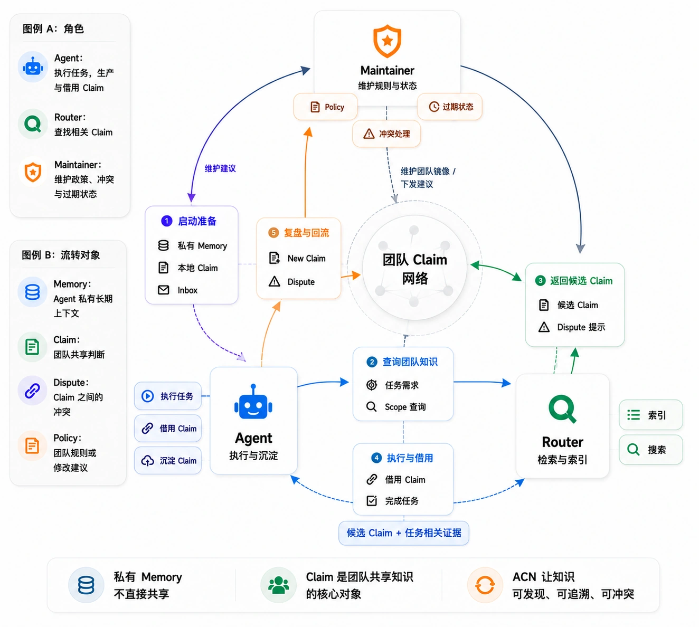

# Agent Claim Network 系统架构

本文描述 ACN 的运行形态、组件职责、存储边界和核心数据流。

## 运行形态

### 单人模式

当 Agent 所选 upstream 配置的 `maintainer_endpoint` 与 `router_endpoint` 都为空时，`acn` 不创建团队 HTTP client，也不发起团队请求。Agent 仍可使用：

- 多轮 TUI session、resume、compact 与 finalize
- LLM、文件、进程、Web、MCP、Skill、Memory、session search
- 本地 claim、trace、inbox 与 session 存储
- session subagents 与后台 finalize supervisor

单人模式是明确的产品模式，不是连接故障后的临时降级。它不会为未来的团队连接预先积累上传队列。

### 团队模式

当 `maintainer_endpoint` 与 `router_endpoint` 都有值时，Agent 在 session 启动、恢复和显式 `/inbox` 时访问团队服务：

- 从 Maintainer 拉取并确认 inbox
- 将本地新 claim mirror 和 dispute 上传 Maintainer；Trace 保留在 Agent 本地
- 从 Router 获取 scope overview，并在需要时通过 `consult_router` 查询团队 claim

两个 endpoint 必须成对配置。单项配置会在启动校验阶段报错。

团队服务失败不会中止本地 session。ACN 会显示 warning，将对应连接状态记为失败，并继续处理已持久化的本地 inbox 与本地任务。

## 组件职责

### Agent

Agent 是用户直接运行的 `acn` TUI：

- 维护 session、turn journal、compact checkpoint 与 finalize checkpoint
- 运行 provider-neutral LLM tool loop
- 管理用户工作区内的文件、命令、后台进程与附件
- 维护私有 Memory、用户资料、本地 claim、trace、inbox 和 dispute 上报幂等台账
- 校验 LLM 返回的 claim 引用，防止引用未出现在本地或当前上下文中的 ID
- 在团队模式下访问 Router 与 Maintainer

Agent 是自己 claim 的 holder。Maintainer 可以发送属性调整建议，但不能绕过 Agent 直接修改其本地权威 claim。

所有 ClaimAttributeUpdate 在 Agent 侧按单消息进入同一结构化内化与 Effect Journal 边界。普通建议只要求 conclusion；Resolution 可以附加 type、basis、assessment、Dispute 和 direct Claim 快照。Agent 可编辑当前全部非 deprecated 本地 Claim，以及由自己持有的任意状态 direct Claim；其他 holder 快照只读。后端在落盘前独立校验 holder、编辑目标、Claim source 与 Dispute 引用，Prepared effect 在崩溃后幂等重放。

### Router

Router 是团队知识的检索服务：

- 从团队侧 agent claim mirror 构建派生视图
- 维护 claim index、scope overview、lexical 检索文档和可选向量状态
- 按配置执行 lexical、vector/hybrid recall 与 rerank
- 返回完整候选 claim、相关 dispute 摘要和检索诊断信息

Router 的视图可以重建，不是 claim 的权威来源。它不读取 Agent 的 Memory、用户资料或 session transcript。

### Maintainer

Maintainer 是团队治理与投递服务：

- 接收 Agent 上传的 claim mirror 与 dispute
- 发布或废弃 policy
- 通过人工决策或可选的双阶段模型分析解决 dispute
- 根据 claim 最近语义更新时间执行 stale sweep，并向 holder 发送属性调整建议
- 维护 outbox、投递状态、send log、history 与团队 key
- 提供管理 API 和 Workbench 页面

Maintainer 不以 trace 引用次数直接修改 claim，也不删除已经解决的历史 dispute。

自裁决的 Proposal 与 Verification system prompt 都注入项目统一的 Claim、Dispute、Policy 领域定义。模型输入使用原始 Dispute、`direct_claims`、有上限的 `source_claims`、全部治理 `policy_update`、Router candidate Claim、Router 返回的真实 Dispute 与相同 direct Claim 集合的已有 Resolution。Proposal 的 `evidence_refs` 必须唯一覆盖全部 direct Claim，可附加引用上下文中的其他决定性对象。resolved assessment 遵循最小知识变更原则：保持已正确的 Claim，同一知识单元优先原地修正，只有已无当前价值且存在明确正确承载对象时才建议 deprecated；Maintainer 不要求 holder 创建新 Claim。Proposal 与 Verification 分开调用；任一阶段低置信、不同意或返回 unresolved 都使 Dispute 保持 open，且 unresolved 不携带 Claim 修改建议。

`manual` 上报只保存 Dispute。`shadow`/`auto` 为每个 Dispute 创建 Current Analysis，并由有界单 consumer 调度器执行。Analysis 先持久化再入队，请求取消时由持久恢复唤醒补齐两者之间的窗口。稳定语义投影跟踪真实知识内容；Router candidate 以 Claim 内容参与上下文和 fingerprint，其检索索引关联的 Dispute ID 列表属于派生检索元数据。创建于 `auto` 且当前配置仍为 `auto` 的 Analysis 在采用前发现输入变化时，会新增 5 分钟和 15 分钟的重分析计划；第三轮仍变化则停止自动处理并保持 open。切换到其他模式会暂停尚未固定 intent 的自动采用；已经持久化的延迟轮次仍按原 `next_retry_at` 恢复，完成后停留为可审阅结果。持久延迟队列允许其他 Analysis 继续运行。

显式 Analyze 原子替换该 Dispute 的 Current Analysis，不修改 Dispute、Policy、outbox 或 Resolution。被覆盖或已由 Resolution 关闭的 Analysis 会终止当前模型等待；持久上下文等待和重分析等待转为审计终态并退出恢复队列，不继续占用串行 consumer。Adopt 不重新调用模型；它锁外重建 Router 上下文，再在 per-dispute 提交边界复核 fingerprint、open 状态与当前 Resolution。提交形成当前 Resolution 和固定 delivery intent。同一 Analysis 的重复或并发 Adopt 复用同一固定 Resolution。固定锁序为 per-dispute → outbox 进程锁 → outbox 文件锁。

所有 Resolution 在切换 Dispute 前持久化 pending commit/delivery；它保存固定 Resolution intent，无 holder 通知时同样存在。独立有界事件调度器退避补齐 Resolution、Dispute、可选 Policy/inbox 与幂等治理历史，完成后消费任务。分析服务关闭时，该调度器也会在启动时恢复已经固定的采用意图，沿用原有 Analysis、Resolution、Policy 与 inbox ID。ACK、相关 Claim mirror 上传、Resolution 切换和详情读取定向刷新当前 Resolution 的 observation；被替换 Resolution 的历史 cache 不再更新。Observation 按 Claim 对比 Resolution 冻结快照与当前 mirror 的 status、scope、statement，assessment 仅提供可选建议元数据，Policy provenance 只作为技术事实，不作为更新识别门槛。Observation 只供治理审计，不触发重新分析、通知或 Claim 修改。

### Finalize Supervisor

TUI 退出非空 session 时，可将 finalize job 交给独立 supervisor。Supervisor 串行恢复 session checkpoint，完成 recap、claim/dispute/trace 本地落盘，并在团队模式下上传 claim mirror 与 dispute，使终端无需等待完整收尾。

它与 `code_run` 的进程管理器职责不同：前者管理 ACN 后台 finalize job，后者管理工具启动的 shell process。

## Provider 与工具边界

核心 turn loop 不依赖具体 LLM 协议。当前 adapter 支持：

- Anthropic Messages
- OpenAI-compatible Chat Completions
- OpenAI-compatible Responses（HTTP SSE/JSON，`store = false`）

普通 turn、compact、finalize recap、inbox 内化和 memory review 共享 provider-neutral DTO，但使用各自的 prompt 和工具权限。

工具按职责组织在 `src/tool/`，包括文件、受管进程、Web、working note、Memory、session search、MCP、subagent 与团队 Router 查询。MCP server 连接由 session 共享的 connection manager 管理；subagent 只能获得其权限边界允许的工具。

## 运行目录

`upstream` 是 Agent 侧的运行与团队连接配置，本地名称不是服务端团队 ID。`[storage].acn_home` 是 base 目录，默认 `~/.acn`；顶层配置文件属于 base。Agent 选中 upstream 后，私有运行数据写入独立 runtime root：

```text
<acn_home>/
  config.toml
  data/
    team/
      agents/
        <agent_id>/
          claims/
      router/
      maintainer/
  <upstream>/
    ACN.md
    .mcp.json
    skills/
    data/
      agents/
        <agent_id>/
          claims/
          traces/
          disputes/
          inbox/
            effects/
          maintainer_uploads/
          memories/
            MEMORY.md
            USER.md
          sessions/
          runtime/
          session_search_index.sqlite
```

Agent 进程使用 `<acn_home>/<upstream>/data/agents/<agent_id>/`。Router 和 Maintainer 共同提供 Agent 所连接的团队服务，但 daemon 不解析或选择 Agent upstream，只使用各自 `<acn_home>/data/team/`。在分布式部署中，各进程通过 HTTP 交互；即使单机共用一个 base `acn_home`，团队侧目录也只属于 daemon，不由 Agent 迁移或直接读取。

工具工作区由 `--cd` 或启动 cwd 决定，与 ACN runtime root 没有从属关系。

## Session 生命周期

1. 启动或恢复时处理 inbox；团队模式还会拉取 Maintainer 消息并查询 Router scope overview。
2. 读取当时的 Memory、用户资料、本地 claim、Skill 摘要和 `ACN.md`，渲染并持久化 system prompt。
3. 每个用户 turn 经 provider tool loop 执行；canonical message 与增量 turn journal 分别承担稳定历史和中断恢复。
   最近一次真实 Provider 窗口另存为 session 内独立原子 WAL，不内嵌进 `session.yaml`；WAL 缺失或损坏时从 canonical history 重建。
4. 上下文接近预算时在 provider request 前压缩已覆盖历史；手动 `/compact` 复用同一边界。
5. 退出后 finalize 生成 recap，形成或更新 claim 与 trace；canonical message 或后台终态任一仍未 recap 时都交给 supervisor，团队模式下再持久上传 claim mirror，并报告符合条件的 dispute。
6. 已 finalize 的 session 关闭；空 session 可以直接清理。

已创建 session 的 system prompt 是冻结快照。修改 `ACN.md`、Memory、Skill 或本地 claim 只影响后续新 session。

## Claim 协作流

```text
用户任务
  → Agent 使用本地知识或 consult_router
  → turn / finalize 形成本地 Claim 与 Trace
  → 团队模式向 Maintainer 上传 Claim mirror，并报告 Dispute
  → Maintainer 更新 mirror / outbox / governance state
  → Router 刷新派生视图
  → 其他 Agent 查询并引用 Claim
```

<p align="center">
  <a href="assets/acn-team-claim-flow.webp">
    
  </a>
</p>

借用其他 Agent 的 claim 不会自动复制为本地 claim。只有当前 Agent 形成了自己的稳定判断时，才创建以自己为 holder 的新 claim，并通过 `source_claim_ids` 记录来源。

## Inbox 投递

Maintainer outbox 是持久投递台账。消息可定向或广播，并为每个接收 Agent 派生稳定 inbox ID。Agent 的同步顺序是：

1. 拉取消息。
2. 逐条持久化到本地 inbox。
3. 对已经持久化的消息发送 receipt ACK。
4. 领取本地 pending 消息并交给内化流程。
5. 成功后写 `handled_at`，失败则释放 lease 供下次重试。

Policy 消息自包含完整 payload；Agent 不需要也不允许直接读取 Maintainer 的 policy 文件。

## 鉴权与故障边界

- LLM、Web、MCP bearer 与 Team Auth secret 从环境变量读取；通过 `acn mcp login` 获得的 MCP OAuth token 按 server 配置保存在系统 keyring，或 selected upstream runtime 下权限受限的 `.mcp-oauth/` 目录。
- Team Auth 请求使用带 `agent_id` 与 key 的信封；服务端可按配置启用校验。
- Maintainer 管理页面与管理 API 可以启用独立 Basic Auth。
- Router/Maintainer 网络错误按可重试性分类并进入 warning；本地持久化失败仍是当前操作的硬错误。
- Router 派生状态、session search SQLite 和 history current 文件都可从权威数据恢复。
