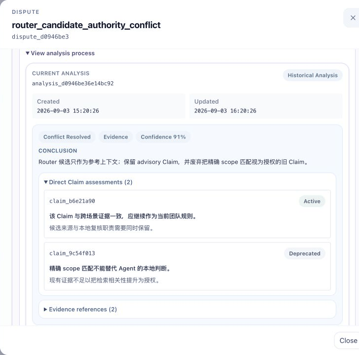

# Maintainer 自裁决说明

Maintainer 自裁决用于处理团队 Claim 之间的 Dispute。它会整理治理上下文，生成分析记录（Analysis）并进行独立复核；满足条件后，再形成可投递、可追踪的正式裁决（Resolution）。

自裁决不改变 Claim 的所有权。Maintainer 只向相关持有者（holder）发送治理建议，不直接修改 Agent 的本地 Claim。配置字段见[配置参数](config_parameters.md#maintainerarbitration)，本文重点说明功能行为、使用方式和审计入口。

## 模式

`enabled` 控制模型分析是否可用，`mode` 控制新 Dispute 的分析和采用方式。

| 配置 | 新 Dispute 上报后 | 如何形成正式裁决 |
| --- | --- | --- |
| `enabled = false` | 只保存 Dispute，不调用模型 | 管理员人工处理 |
| `mode = "manual"` | 只保存 Dispute | 管理员发起分析并采用，或直接人工处理 |
| `mode = "shadow"` | 自动生成并复核分析 | 管理员确认后采用，或直接人工处理 |
| `mode = "auto"` | 自动生成并复核分析 | 分析通过、上下文稳定时自动采用 |

建议新团队先使用 `shadow`，确认分析质量和证据完整性后再决定是否切换到 `auto`。争议风险较高或需要逐项审批时，使用 `manual` 更合适。

模式切换不会改变已有分析的采用边界：在 `manual` 或 `shadow` 下创建的分析，切换到 `auto` 后也不会自动采用；`auto` 下尚未完成的自动采用，在切换到其他模式后会停止，重新启用 `auto` 时可按持久记录恢复。

`enabled = false` 只停止新的模型分析。已经固定的裁决或投递意图仍会在启动后恢复，这部分不需要再次调用模型。

## 裁决使用哪些信息

每轮分析会冻结一份上下文，内容包括：

- 原始 Dispute 和其中直接引用的 Claim；
- 直接 Claim（direct Claim）的来源 Claim，数量受 `max_source_claims` 限制；
- 当前有效、类型为 `policy_update` 的团队 Policy；
- Router 返回的候选 Claim 和相关 Dispute；
- 直接 Claim 集合相同的既有正式裁决；
- 上下文准备过程中产生的警告。

Maintainer 不读取 Agent 的 `MEMORY.md`、`USER.md`、会话记录、Trace 或工具上下文。直接 Claim 的团队镜像尚未到齐时，分析会先等待上下文，不会在材料不完整时调用模型。

## 自裁决流程

1. **接收并保存 Dispute**

   Maintainer 校验上报状态和直接 Claim，将原始 Dispute 持久化。`manual` 到此等待管理员操作；`shadow` 和 `auto` 同时创建当前分析并进入调度队列。

2. **生成提案（Proposal）**

   第一阶段根据冻结上下文提出结论，输出裁决类型、依据、逐 Claim 建议、证据引用和置信度。证据引用必须覆盖全部直接 Claim，不能引用上下文之外的对象。

3. **独立复核（Verification）**

   第二阶段独立检查提案，分别核对裁决类型、依据、结论和每条 Claim 建议。它使用相同的冻结上下文，但不会把提案当作既定事实。

4. **判定分析结果**

   提案和复核的置信度都达到 `confidence_threshold`，复核同意全部核心字段和逐 Claim 建议，分析才进入 `approved`。任一阶段认为证据不足、低于门槛或复核不通过，结果均为 `unresolved`；调用或协议校验失败则记为 `failed`。这两种情况都不会关闭 Dispute。

5. **采用分析**

   `manual` 和 `shadow` 需要管理员点击 `Adopt`。`auto` 会在采用前重新构建上下文；若输入未发生实质变化，自动形成正式裁决。若输入发生变化，则在等待后重新分析，最多三轮；仍不稳定时停止自动处理，保留 open 状态交由管理员判断。

6. **提交、投递和观察**

   正式裁决提交后，Dispute 变为 resolved，并为相关持有者生成 Claim Attribute Update、Policy 和 inbox 投递记录。后续回执确认和 Claim 镜像上传会刷新 Holder Adoption 视图。整个过程先持久化再调度，Maintainer 重启后可继续未完成任务，并复用原有 ID 避免重复裁决或重复投递。

  

演示按审计顺序展示一条已裁决的 Dispute：先查看 Analysis 的结论和独立复核，再核对 Resolution 建议，最后在 `Delivery & Holder Adoption` 中确认消息是否送达、Claim 是否更新，以及裁决前后的差异。画面来自 Workbench 内置演示数据的原始浏览器截图，只裁掉左侧遮罩区域，没有缩小或锐化；六张清晰图均从对应模块标题或 Claim 名称开始，按顺序组成 GIF。演示数据不会连接 Maintainer、Router 或其他外部服务。

## 裁决结果

分析可以给出四类判断：

| 类型 | 含义 | 是否关闭 Dispute |
| --- | --- | --- |
| `coexist` | Claim 分属不同范围、版本、环境或路径，当前可以并存 | 是 |
| `lifecycle_update` | 团队基线已经迁移，旧知识需要更新或退出 | 是 |
| `conflict_resolved` | Claim 在可比较条件下冲突，现有证据足以选择结论 | 是 |
| `unresolved` | 缺少关键证据，或两阶段分析存在实质分歧 | 否 |

裁决依据分别记录为直接 Claim 分析（`direct_analysis`）、既有裁决（`prior_resolution`）、团队 Policy（`policy`）或其他证据（`evidence`）；证据不足（`insufficient_evidence`）只会得到 `unresolved`，不会形成正式裁决。

前三类结果必须完整覆盖每条直接 Claim，给出建议状态、判断和理由，并可建议调整 scope 或 statement。`unresolved` 不提供 Claim 修改建议。

## 管理员操作

启动 Maintainer 后，打开 `http://<maintainer-listen>/app`，进入 `Disputes`。

- `Analyze`：为 open Dispute 创建或替换当前分析。每个 Dispute 只保留一份当前分析，被替换的分析不形成历史链。
- `Adopt`：采用当前 `approved` 分析，不再调用模型。采用前会复核 Analysis ID、Dispute 状态和上下文；数据已变化时返回冲突，由管理员刷新后重新判断。
- `Resolve Dispute`：跳过模型结果，直接提交人工裁决。
- `Reject & Replace`：驳回自动裁决并提交替代结论，必须填写驳回原因。

正式裁决仍是治理建议。持有者可以保持现状、修改既有 Claim 或创建新的知识单元；Maintainer 不要求逐字段照搬建议。

## 审计方法

Workbench 中可以按以下顺序检查一条 Dispute：

| 检查内容 | 页面位置 | 重点 |
| --- | --- | --- |
| 原始争议 | `Direct Claims`、`Summary` | 直接 Claim 是否完整，范围和证据是否可比较 |
| 两阶段分析 | `Current Analysis` | 提案、独立复核、置信度、证据引用、警告和分析轮次 |
| 正式裁决 | `Current Resolution` | 自动或人工、裁决类型、依据、结论和逐 Claim 建议 |
| 投递与后续变化 | `Delivery & Holder Adoption` | 是否送达，裁决快照、首次内化快照与当前 Claim 镜像的差异 |
| 管理操作 | `HTTP Audits` | Analyze、Adopt、人工处理和驳回替换的请求时间、来源地址与结果 |

`Delivery & Holder Adoption` 只说明 Maintainer 观察到了什么：回执确认表示消息已安全持久化，不等于 Claim 已完成内化；Claim 镜像发生变化也不能单独证明变化完全由该正式裁决引起。

需要离线核对或排障时，可检查 `<acn_home>/data/team/maintainer/`：

- `disputes/`：原始 Dispute 和当前状态；
- `arbitrations/<dispute-id>/analysis.yaml`：Current Analysis、冻结上下文、两阶段输出和轮次；
- `arbitrations/<dispute-id>/resolution.yaml`：当前正式裁决及投递意图；
- `arbitrations/<dispute-id>/observations/`：持有者投递与 Claim 变化观察；
- `outbox/`：发给持有者的投递台账；
- `history/dispute_resolution_events/current.jsonl`：裁决事件；
- `history/resolution_observation_events/current.jsonl`：观察事件；
- `history/http_audit_logs/current.jsonl`：HTTP 管理操作记录。

审计时可用 `dispute_id`、`analysis_id`、`resolution_id`、`policy_id` 和 `inbox_id` 串联各页面与文件。持久文件用于审计和恢复，不应在 Maintainer 运行时手工修改。
